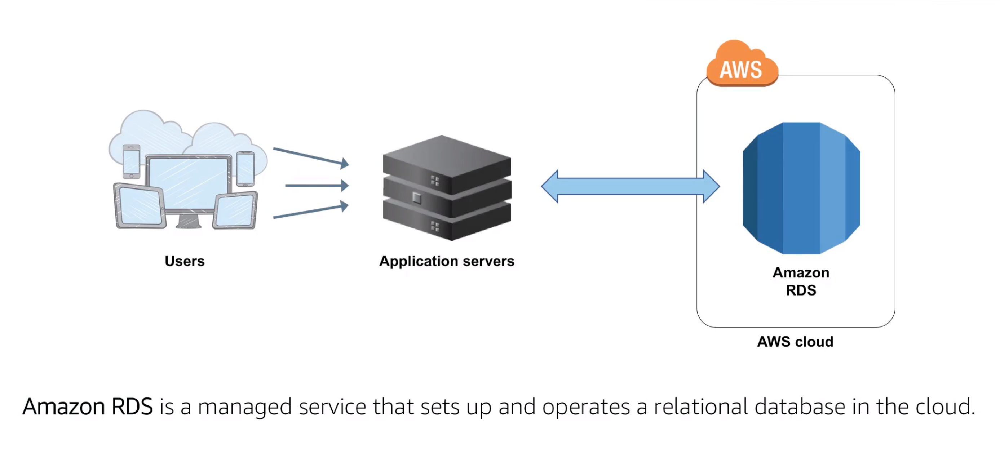

# AWS Integrated Services

  1. Application Load Balancer
      + Type
         + Classic Load Balancer
         + Network Load Balancer
      + Enhanced Features
        + Supported Protocols
          > HTTP, HTTPS, HTTP/2 and WebSockets
        + CloudWatch Metrics
          > Additional load balance metrics and Target Group metrics dimension
        + Access Logs
          > Ability to see connection detail for WebSocket connects
        + Health Checks
          > Insight into target and application health at more granular level
      + Additional Features
        + Path and Host-based Routing
          > Path-based provides rules that forward requests to different target groups (Added Feature)

          > Host-based can be used to define rules that forward requests to different target groups based on host name(Added Feature)
        + Native IPv6 Support
        + AWS WAF(Web Application Firewall)
        + Dynamic Ports
          > Amazon ECS integrates with Application Load Balancer to expose Dynamic Ports utilized by scheduled containers.
        + Deletion Protection & Request Tracing
          > Request tracing can be used to track HTTP requests from clients to target(Added Feature)
      + Key Terms
        + Listeners
          > A listener is process that checks for connection requests, using the protocol and port that you configure. The rules that you define for a listener determine how the load balancer routes requests to the targets in one or more target groups.
        + Target
          > A target is a destination for the traffic based on the established listener rules.
        + Target Group
          > Each target group routes requests to one or more registered targets using the protocol and port number specified. A target can be registered with multiple target groups. Health checks can be configured on a per target group basic.
      + Use Cases
        1. To host the micro services and route to the application in a single load balancer
          
          

  1. Auto Scaling
      > Auto Scaling helps you ensure that you have the correct number of Amazon EC2 instances available to handle the load for your application 

      + Auto Scaling Components
        1. Launch Configuration (What to be run)
            + AMI
            + Instance type
            + Security Groups
            + Roles
        1. Auto Scaling Group(Where to be run)
            + VPC and Subnet(s)
            + Load balancer
            + Minimum instances
            + Maximum instances
            + Desired capacity
        1. Auto Scaling Policy(When to be run)
            + Scheduled
            + On-demand
            + Scale-out policy
            + Scale-in policy
      + Dynamic Auto Scaling
        

  1. Amazon Route 53
      + What Is Route 53
        
        > Route 53 is a Domain Name System or DNS which is a service designed to provide businesses and developers a reliable and highly scalable way to route users to endpoints.

      + How Does It Work
        
        

      + DNS Resolution Strategies
        + Simple routing
        + Geo-location
        + Failover
        + Weighted round robin
        + Latency-based
        + Multiple-value answer

  1. Amazon Relation Database Services(RDS)
      
      + Challenges of Relational Database
          + Server maintenance and energy footprint
          + Software install and patches
          + Database backups and high availability
          + Limits on scalability
          + Data security
          + OS install and patches

      + Database Instances
        

      + RDS in your VPC
        

      + High Availability with multiple AZ
        
        

      + RDS Read Replicas
        + Asynchronous replication method used
        + Offload read queries from the master DB instance
        + Ideal for read-heavy database workloads
        + Read replica can be promoted to Master if needed
        

      + Use Cases
        + Web and Mobile Applications
            + High throughput
            + Massive storage scalability
            + High availability
        + E-commerce Applications
            + Low-cost database
            + Data security
            + Fully managed solution
        + Mobile and Online Games
            + Rapidly grow capacity
            + Automatic scaling
            + Database monitoring
      + Benefits
        + Highly scalable
        + Hight performance
        + Easy to administer
        + Available and durable
        + Secure and compliant

  1. AWS lambda
      > AWS Lambda is a compute service that lets you run code without provisioning or managing servers. It only executes your code when needed and scales automatically to thousand of requests per second

      + Use Cases
        + Automated back-ups
        + Processing objects uploads to S3
        + Event-driven log analysis
        + Event-driven transformations
        + Internet of things
        + Operating serverless websites

      + Real Time Image Processing
        
      + Real Time Stream Processing
        
      + Extra, Transform, Load
        
      + IoT Backends
        
      + Mobile Backends
        
      + Web Backends
        
  1. AWS Elastic Beanstalk
      + What is Elastic Beanstalk
          1. Platform as a Service
          1. Allows quick deployment of your applications
          1. Reduces management complexity
          1. Keeps control in your hands(Choose your instance type, database, set and adjust auto scaling)
          1. Supports a large range of platforms
              + Packer Builder
              + Single Container, Multiple Container or Pre-configured Docker
              + GO
              + Java SE
              + Java with Tomcat
              + .Net on windows server with IIS
              + Nodejs
              + PHP
              + Python
              + Ruby
      + Components
        + Application Service
        + HTTP Service
        + Operating systems
        + Language interpreter
        + Host

      + Deployments and Updates
        
  1. Amazon Simple Notification Service(SNS)
        1. Flexible, fully managed pub/sub messaging and mobile communications service.

        1. Coordinates the delivery of messages to subscribing endpoints and clients.

        1. Easy to setup, operate and send reliable communications.

        1. Decouple and scale micro-services, distributed systems and serverless applications

        
  1. Amazon CloudWatch
  1. Amazon CloudFront
  1. AWS CloudFormation
