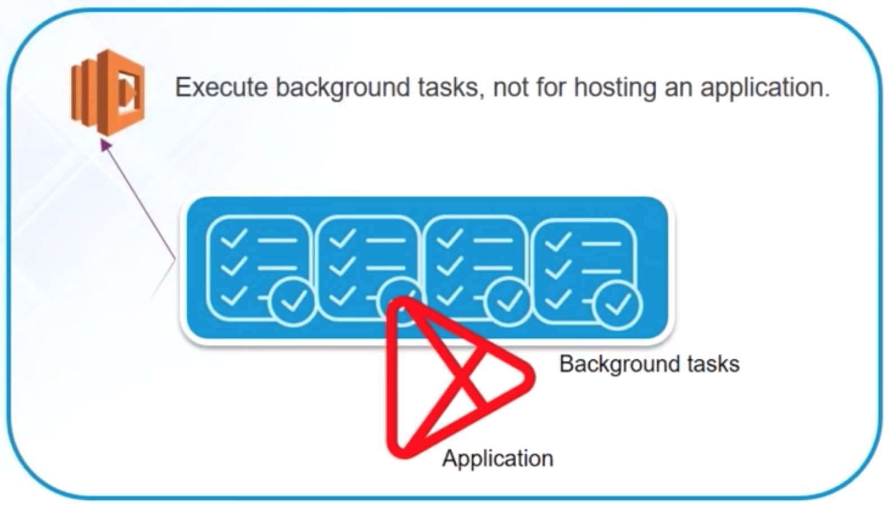
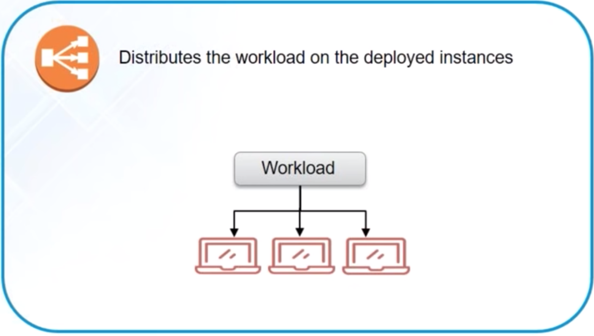

# AWS Certified Solutions Architect

## AWS Compute Services

+ EC2
    

+ Lambda
    
+ Elastic Beanstalk
    
+ Elastic Load Balancer
    
+ AutoScaling
    

## AWS Storage Services

+ S3
  
+ Cloud Front
  
+ Elastic Block Storage
  
+ Glacier
  
+ Snowball
  
+ Storage Gateway
  

## AWS Database Services

+ RDS
  
+ Aurora
  
+ DynamoDB
  
+ Elastic Cache
  
+ Red Shift
  

## AWS Networking Services

+ VPC
  
+ Direct Connect
  
+ Route 53
  

## AWS Management Services

+ Cloud Watch
  
+ Cloud Formation
  
+ Cloud Trail
  
+ CLI
  
+ Ops Works
  
+ Trusted Advisor
  

## AWS Security Services

+ IAM
  
+ KMS
  

## AWS Application Services

+ SES
  
+ SQS
  
+ SNS
  

## AWS Pricing

+ Pay As You Go
  > AWS offers, pay as you go model, that is you only pay what you use

+ Pay less by Using More
  > AWS bills you for the hour. The more AWS resources you use, the less the hourly rates become.

+ Save when you reserve
  > In services like AWS EC2 and RDS, you have an option of reserving your instances for a specific time frame. You are charged less significantly upto 75% less.

